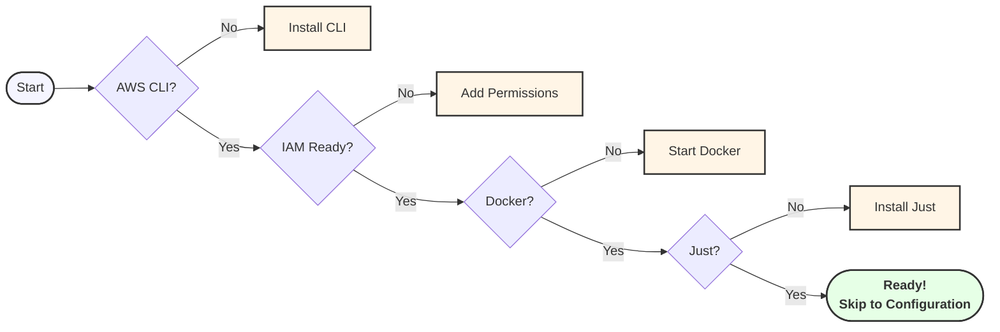

# AWS Lambda Deployment

This directory contains the Terraform configuration for deploying the Jira to Airtable Mirror application to AWS Lambda.

## Prerequisites

1. AWS CLI installed and configured with appropriate credentials
2. Required AWS permissions (see below)
3. Docker installed and running (for building Lambda container images)
4. Just command runner installed

## Deployment Readiness Check

Use this decision tree to quickly determine what you need before deploying:



## Documentation

- [Metrics Monitoring](./docs/metrics.md): Details about available metrics and how to monitor them
- [Notifications](./docs/notifications.md): Information about SNS notifications and subscription options

## Required AWS Permissions

The AWS user executing the deployment needs the following permissions:

### ECR Permissions
```json
{
    "Version": "2012-10-17",
    "Statement": [
        {
            "Effect": "Allow",
            "Action": [
                "ecr:CreateRepository",
                "ecr:DeleteRepository",
                "ecr:DescribeRepositories",
                "ecr:GetAuthorizationToken",
                "ecr:PutImage",
                "ecr:GetDownloadUrlForLayer",
                "ecr:BatchGetImage",
                "ecr:BatchCheckLayerAvailability",
                "ecr:PutLifecyclePolicy"
            ],
            "Resource": "*"
        }
    ]
}
```

### Lambda Permissions
```json
{
    "Version": "2012-10-17",
    "Statement": [
        {
            "Effect": "Allow",
            "Action": [
                "lambda:CreateFunction",
                "lambda:DeleteFunction",
                "lambda:GetFunction",
                "lambda:UpdateFunctionCode",
                "lambda:UpdateFunctionConfiguration",
                "lambda:InvokeFunction",
                "lambda:AddPermission",
                "lambda:RemovePermission"
            ],
            "Resource": "*"
        }
    ]
}
```

### CloudWatch Permissions
```json
{
    "Version": "2012-10-17",
    "Statement": [
        {
            "Effect": "Allow",
            "Action": [
                "logs:CreateLogGroup",
                "logs:DeleteLogGroup",
                "logs:DescribeLogGroups",
                "logs:CreateLogStream",
                "logs:DeleteLogStream",
                "logs:PutLogEvents",
                "events:PutRule",
                "events:DeleteRule",
                "events:PutTargets",
                "events:RemoveTargets",
                "cloudwatch:PutMetricAlarm",
                "cloudwatch:DeleteAlarms",
                "cloudwatch:DescribeAlarms",
                "cloudwatch:GetMetricStatistics",
                "cloudwatch:ListMetrics"
            ],
            "Resource": "*"
        }
    ]
}
```

### SNS Permissions
```json
{
    "Version": "2012-10-17",
    "Statement": [
        {
            "Effect": "Allow",
            "Action": [
                "sns:CreateTopic",
                "sns:DeleteTopic",
                "sns:SetTopicAttributes",
                "sns:Subscribe",
                "sns:Publish",
                "sns:ListTopics",
                "sns:GetTopicAttributes"
            ],
            "Resource": "*"
        }
    ]
}
```

## Configuration

### 1. AWS Secrets

Create secrets for your API tokens:

```bash
# Create Jira API token secret
aws secretsmanager create-secret \
  --name jira-api-token \
  --description "Jira API token for sync service" \
  --secret-string "your-jira-token"

# Create Airtable API key secret
aws secretsmanager create-secret \
  --name airtable-api-key \
  --description "Airtable API key for sync service" \
  --secret-string "your-airtable-key"
```

### 2. Terraform Variables

Create a `terraform.tfvars` file:

```hcl
# AWS Configuration
aws_region = "us-west-2"  # Your preferred AWS region

# Jira Configuration
jira_server = "https://your-domain.atlassian.net"
jira_username = "your-email@example.com"
jira_project_key = "PROJECT"
jira_jql_filter = "project = PROJECT"

# Airtable Configuration
airtable_base_id = "your_base_id"
airtable_table_name = "your_table"

# AWS Secrets Manager ARNs (from step 1)
jira_api_token_secret_arn = "arn:aws:secretsmanager:region:account:secret:jira-api-token-xxx"
airtable_api_key_secret_arn = "arn:aws:secretsmanager:region:account:secret:airtable-api-key-xxx"

# Sync Configuration
sync_interval_minutes = "10"
max_results = "1000"
batch_size = "50"

# Field Mappings (customize based on your Airtable fields)
jira_to_airtable_field_map = {
  key = {
    airtable_field_id = "fldXXX"
  }
  summary = {
    airtable_field_id = "fldYYY"
  }
  # Add more field mappings as needed
}
```

## Just Commands

The following Just commands are available for AWS Lambda management:

### Deployment Commands
- `just lambda-build`: Build the Lambda container image
- `just lambda-push`: Push the container image to ECR
- `just lambda-deploy`: Deploy the Lambda function (includes build and push)
- `just lambda-update`: Update Lambda function code without changing configuration

### Monitoring Commands
- `just lambda-invoke`: Manually trigger the Lambda function
- `just lambda-logs`: View CloudWatch logs for the function in real-time
- `just lambda-logs-recent [minutes]`: View recent logs (default: last 30 minutes)
- `just lambda-logs-level [level] [minutes]`: View logs filtered by level
  - Levels: DEBUG, INFO, WARNING, ERROR, CRITICAL (default: INFO)
  - Shows logs at specified level and higher
  - Example: `just lambda-logs-level level=WARNING minutes=60`
- `just lambda-metrics [period]`: View function metrics
  - Supports periods: `1h`, `24h`, `7d`
  - Shows comprehensive metrics including:
    - Invocations and errors
    - Duration statistics
    - Memory utilization
    - Network usage
    - Concurrency stats

For detailed information about metrics and notifications, see:
- [Metrics Monitoring Guide](./docs/metrics.md)
- [Notifications Guide](./docs/notifications.md)

## Configuration System

The Lambda function uses an environment-aware configuration system that automatically handles AWS-specific requirements:

### Environment Variables

The Lambda function will automatically have `ENVIRONMENT=aws` set, which activates the AWS-specific configuration loader. This loader:

1. Reads standard environment variables for non-sensitive configuration
2. Automatically fetches sensitive data (API tokens) from AWS Secrets Manager
3. Validates all configuration before starting the sync

### Required Secrets

Two secrets must be created in AWS Secrets Manager before deployment:

1. Jira API Token:
   - Create a secret for your Jira API token
   - Note the ARN and set it in `terraform.tfvars` as `jira_api_token_secret_arn`
   - The Lambda function will reference this via `JIRA_API_TOKEN_SECRET_ARN`

2. Airtable API Key:
   - Create a secret for your Airtable API key
   - Note the ARN and set it in `terraform.tfvars` as `airtable_api_key_secret_arn`
   - The Lambda function will reference this via `AIRTABLE_API_KEY_SECRET_ARN`

### IAM Permissions

The Lambda function's IAM role automatically includes the necessary permissions to:
- Read from AWS Secrets Manager
- Write logs to CloudWatch
- Be invoked by EventBridge for scheduled runs

### Configuration Flow

1. Lambda starts with `ENVIRONMENT=aws`
2. AWS configuration loader initializes
3. Environment variables are read
4. Secrets are fetched from AWS Secrets Manager
5. Configuration is validated
6. Sync process begins

## Deployment

We use the `just` command runner for deployment. Available commands:

```bash
# Deploy the Lambda function
just lambda-deploy

# Destroy all resources
just lambda-destroy

# View logs
just lambda-logs

# Invoke the function manually
just lambda-invoke
```

## Monitoring

### CloudWatch Alarms

The deployment includes CloudWatch alarms for:
- Memory utilization (80%, 90%, 95% thresholds)
- Error rate monitoring

These alarms will notify through an SNS topic. To receive notifications:

1. Get the SNS topic ARN from Terraform outputs:
```bash
terraform output sns_topic_arn
```

2. Subscribe to the topic:
```bash
aws sns subscribe \
  --topic-arn <sns_topic_arn> \
  --protocol email \
  --notification-endpoint your-email@example.com
```

### CloudWatch Logs

View logs in CloudWatch:
1. Go to CloudWatch > Log groups
2. Find the group `/aws/lambda/jira-to-airtable-mirror`

### CloudWatch Metrics

Monitor Lambda metrics:
1. Go to CloudWatch > Metrics > Lambda
2. Key metrics:
   - Invocations
   - Duration
   - Memory utilization
   - Error count

## Cleanup

To destroy all resources:

```bash
just lambda-destroy
```

This will remove:
- Lambda function
- ECR repository and images
- CloudWatch log group
- CloudWatch alarms
- SNS topic
- IAM roles and policies
- EventBridge rules
